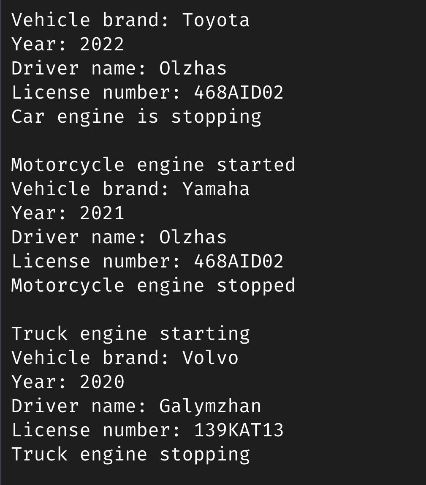

# Assignment 2 — Vehicle Management System

A. Project Overview
This project is a simple Vehicle Management System to demonstrate Object-Oriented Programming concepts.  
It shows the use of inheritance, abstraction, composition, and aggregation.

Vehicle is an abstract superclass with `startEngine() and stopEngine() as abstract methods.  
Car, Motorcycle, and Truck are subclasses that implement the abstract methods.  
Driver objects are associated with vehicles to show composition (one driver per vehicle) and aggregation (one driver can drive multiple vehicles).  
Vehicles are stored in an array and processed polymorphically.

B. Class Hierarchy
Superclass shares the common attributes, that are inherated by subclasses
Subclass inherits all public and protected members of its parent and can also add its own unique fields and methods

Vehicle (abstract)  
├─ Car  
├─ Motorcycle  
└─ Truck  
Driver  

Vehicle is an abstract, that has fields like:"Protected brand", "Protected year", "Protected driver". Abstract methods are:"startEngine()", "stopEngine()". Additionally, it has concrete methods "displayInfo()", and "displayDriver()", which prints the brand, year and driver's information.  
Car, Motorcycle, Truck are subclasses of Vehicle: Each overrides "startEngine()" and "stopEngine()". Each has its own extra fields (doors, fuelType, hasSidecar, capacity, numAxles)  
Driver class has two private fields, name for the driver’s name and licenseNumber for the driver’s license. It includes a method displayDriverInfo() that prints the driver’s details.   
In this system, each Vehicle object has a Driver object to demonstrate composition, and a single Driver can be associated with multiple vehicles to demonstrate aggregation.  
The protected access modifier in the Vehicle class allows subclasses to access the shared fields, while private fields keep subclass-specific and Driver information encapsulated.

C. Compilation
To compile and run 
1. Open terminal / command line  
2. Navigate to src folder  
3. Compile all Java files writing in cmd "javac *.java"
4. Run the program with "java Main"

D. Output of the program

